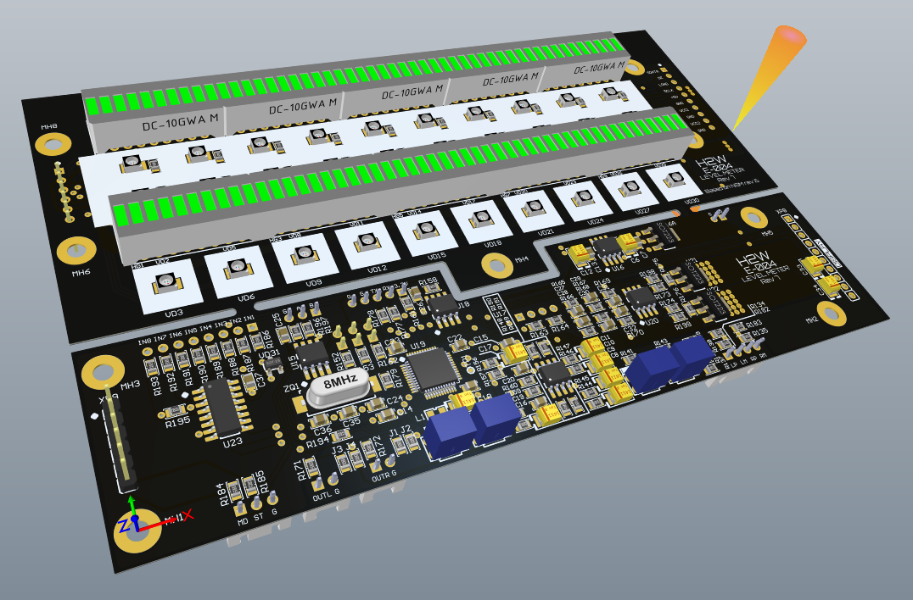

# UV Meter for the audio tape recoder 

For my project, a complete renovation of the tape recorder "Elektronika 004" produced in the USSR, UV level indicator. The original NSM design was modified by me for the sake of a few cosmetic changes. 

- The silk-screening has been changed
- Analyzed the integrity of circuits
- Added slave I2C interface

Below is a rendering of the printed circuit board.

